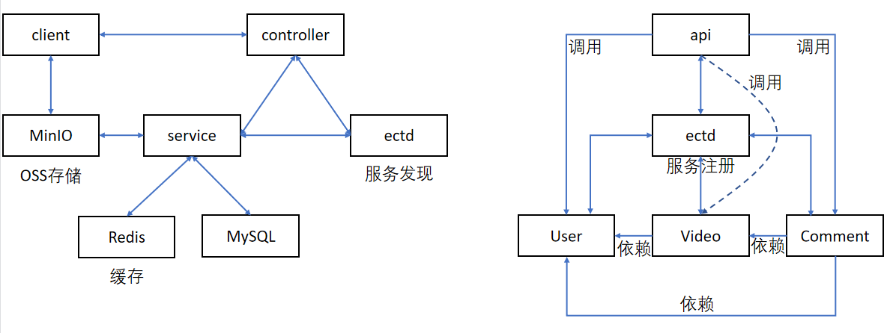
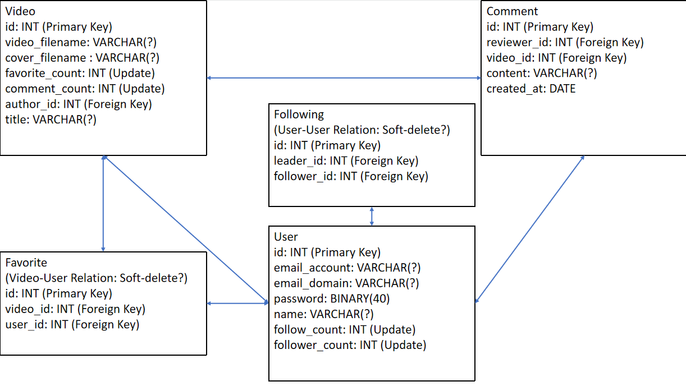

# douyin-demo 真菜鸡互啄队

## 目录

- [运行项目](#运行项目)
- [项目架构及主要技术栈](#项目架构及技术栈)
    - [项目架构](#项目架构)
    - [项目主要技术栈](#项目包含技术栈)
- [项目接口文档](#项目接口文档)
- [文件目录结构](#文件目录结构)
- [功能说明](#功能说明)
- [测试数据](#测试数据)
- [其他说明](#其他说明)

### 运行项目
Linux环境下
```shell
docker compose up -d
bash run.sh
```

### 项目架构及技术栈
#### 项目架构
- 该项目采用了微服务架构，微服务之间采用rpc方式调用，使用的rpc框架为Kitex。
- 其中api微服务使用Gin框架对外提供http接口，并通过调用comment、user和video微服务实现业务逻辑。

架构关系图：

数据表E-R关系图：
### 项目包含技术栈

- Kitex
- GORM
- Gin
- gin-jwt (github.com/appleboy/gin-jwt/v2)
- etcd
- MySQL
- GORM
- Redis
- MinIO对象储存服务
- ffmpeg（用于截取视频帧）
- docker（计划托管到容器中）

### 项目接口文档
[抖音极简版接口文档-真菜鸡互啄队](https://www.apifox.cn/apidoc/project-1066782/api-22446795)

### 文件目录结构
```go
├─cmd
│  ├─api （对外提供接口）
│  │  │  main.go （初始化）
│  │  │  router.go （定义访问路由）
│  │  │
│  │  ├─handlers
│  │  │      comment.go
│  │  │      favorite.go
│  │  │      feed.go
│  │  │      handler.go
│  │  │      publish.go
│  │  │      relation.go
│  │  │      user.go
│  │  │
│  │  └─rpc
│  │          comment.go
│  │          init.go
│  │          minio.go
│  │          user.go
│  │          video.go
│  │
│  ├─comment （评论微服务）
│  │  │  handler.go
│  │  │  main.go
│  │  │
│  │  ├─dal
│  │  │      comment.go
│  │  │      init.go
│  │  │
│  │  ├─rpc
│  │  │      init.go
│  │  │      user.go
│  │  │      video.go
│  │  │
│  │  └─service
│  │          comment.go
│  │          util.go
│  │
│  ├─user （用户微服务）
│  │  │  handler.go
│  │  │  main.go
│  │  │
│  │  ├─dal
│  │  │      follow.go
│  │  │      init.go
│  │  │      user.go
│  │  │      user_test.go
│  │  │
│  │  └─service
│  │          follow.go
│  │          user.go
│  │          util.go
│  │
│  └─video （视频微服务）
│      │  handler.go
│      │  main.go
│      │
│      ├─dal
│      │      favorite.go
│      │      init.go
│      │      video.go
│      │
│      ├─rpc
│      │      init.go
│      │      user.go
│      │
│      └─service
│              favorite.go
│              video.go
│
├─idl （接口定义文件）
│      comment.thrift
│      user.thrift
│      video.thrift
│
├─kitex_gen （Kitex生成文件）
│
└─util （项目工具及常量文件）
        client.go
        common.go
        config.go
        cpu.go
        error.go
        fakedata.go
        response.go
        server.go
        tracer.go
        util.go
        video.go
```
### 功能说明

* 静态资源模式下(util.STATIC=true)视频上传后会保存到本地 public 目录中，访问时用ip:8080/static/videos/video_name，封面在static/covers/
* OSS存储模式下(util.STATIC=false)，视频和封面会托管到MinIO，需要在本地生成一次封面，需要使用```docker compose up```启动若干容器

### 测试数据

- 测试数据写在若干fakedata.go

###其他说明

- 修改了"github.com/appleboy/gin-jwt/v2"库的auth_jwt.go里面的ParseToken，增加了一个从request body的form获取token的方式，为了兼容所有接口。
- 提的PR已合并，go.mod 设置依赖为 github.com/appleboy/gin-jwt/v2 v2.8.1-0.20220605135842-8f9474155532 及以上即可。
